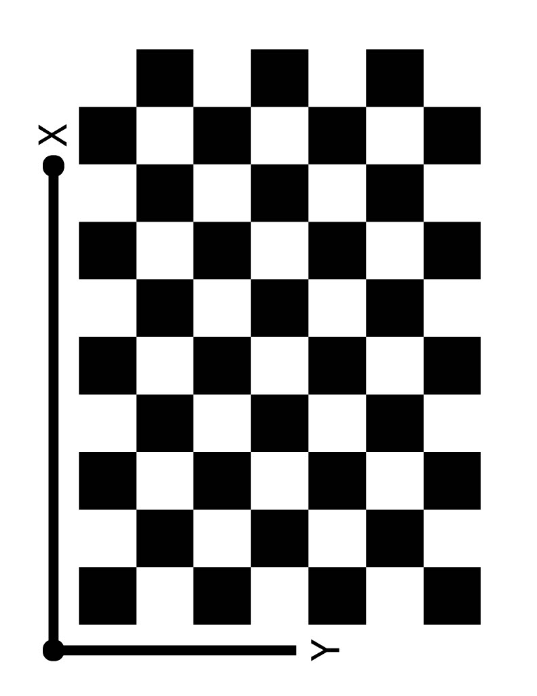
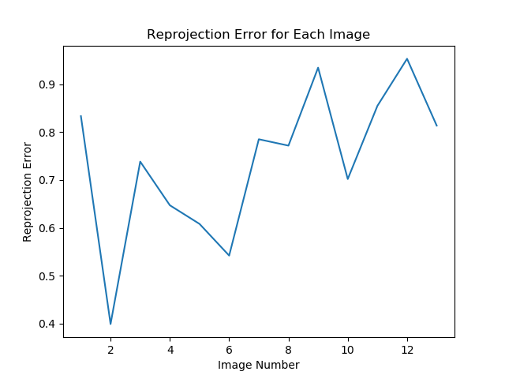

# AutoCalib
Automatic Camera Calibration using Zhang's Method with a Checkerboard Pattern

The camera calibration pipeline used here is an implementation of Zhang's Camera Calibration Algorithm (based on [this](https://www.microsoft.com/en-us/research/wp-content/uploads/2016/02/tr98-71.pdf) paper).
<ul>
<li> Obtain a reference chessboard with an odd number of interior (exluding borders) squares along each axis (with an unequal number of squares along each axis).
<li> Take a printout of that chessboard and capture a couple images of that chessboard using the camera you wish to calibrate with all interior squares of the chessboard visible in each frame.
<li> Detect the locations of each interior square corner for the base/reference chessboard (its digital image version) along for all the captured images.
<li> Find the homography from the paper/base image coordinate system to the camera coordinate system (captured image) for each captured image.
<li> Using all the homographies (one per captured image), generate multiple V vectors and use Singular Value Decomposition (SVD) to get an initial estimate of the intrinsic camera matrix (K) and the rotation and translation transformation corresponding to the homography for each captured image.
<li> Assuming the initial estimate for the distortion parameters (of order 2) to all be zero (a reasonable assumtpion for most cameras/webcams that probably already perform undistortion before displaying the image), calculate the reprojection error for each corner for each image and optimize this value to using a least-squares optimizer to get a better/more accurate intrinsic camera matrix and distortion parameters.
<li> Using the new and more accurate intrinsic camera matrix and distortion parameters, re-calculate the new rotational and translational transformations corresponding to the homography of each captured image and re-calculate the reprojection error and plot the value for each image.
<li> Reproject the corners from pixel/camera coordinate system to the paper'c coordinate system and overlay them over the ground-truth corners (detected in step 2) for each captured image.
<li> Undistort and display each image using the intrinsic camera matrix and distortion parameters.
</ul>

The original checkerboard from which the actual checkerboard corners are taken reference from is shown below.

  

A sample image taken from a camera whose intrinsic parameters are not known is displayed below.

  

The graph showing the reprojection error for each image after calibration is shown below.

  

A sample image now undistorted using the computed distortion parameters is shown below.

  

The corners reprojected (red) using the computed camera intrinsics and distortion parameters over the actual detected corners (blue) for a sample image.

  

